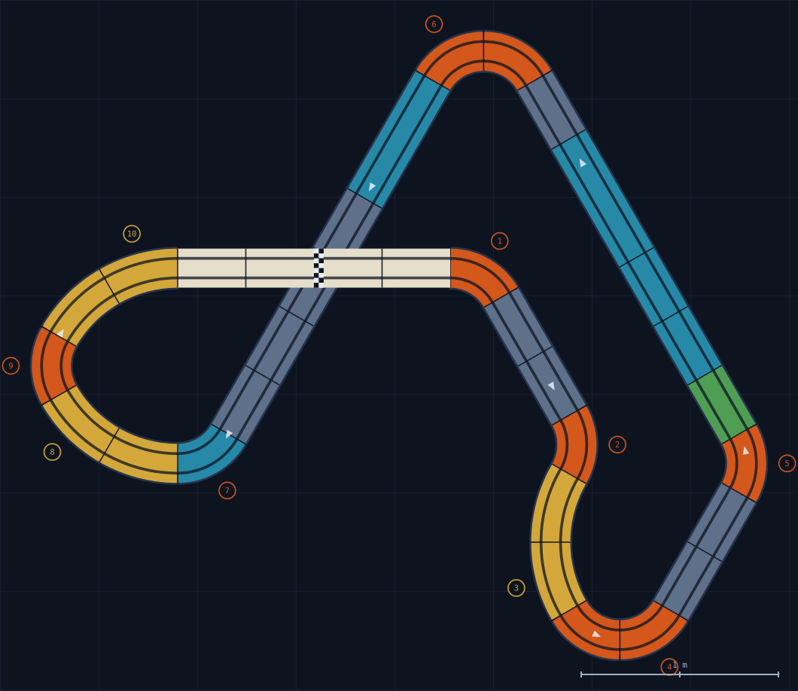

# TrackMarshal

**Agent-native track design for Carrera 1:24/1:32 slot-car racing** — an open piece catalog on WarmHub, a closure-verified layout solver, and skills that let your AI agent design tracks from the pieces you actually own.

The track-planning apps died (Carrera's official planner is discontinued; TrackPower and Ultimate Racer are abandoned). The knowledge shouldn't have. TrackMarshal rebuilds it as open, composable data plus a small amount of exact geometry — so any agent can answer: *"What's the best track I can build with my pieces, in my room, for my kind of racing?"*

<p align="center">
  
</p>
<p align="center"><em>“Skybridge Thunder” — designed by an agent from a real inventory, closure-verified to ±5 mm / 0.5°, rendered at exact geometry. The <a href="designs/">designs/</a> folder has the printable build sheets.</em></p>

## The stack

| Layer | Where | What |
|---|---|---|
| **Public catalog** | [`slotcars/carrera-catalog`](https://app.warmhub.ai/orgs/slotcars) on WarmHub | Every piece type with adjudicated geometry (centerline radii 297/495/693/891 mm — verified against Carrera's own published circuit plans), cars and spare/upgrade parts with tire-fitment claims (third-party tires first-class, vendor conflicts preserved), every retail product with box contents, and per-datum source provenance (`SpecClaim`s — conflicting sources preserved, not averaged) |
| **Your repo** | one per racer, e.g. [`wjcorey/carrera-track`](https://app.warmhub.ai/orgs/wjcorey) | Inventory (`Holding`s asserted *about* catalog pieces — composed, never copied), rooms, saved layouts with bill-of-materials, build logs, feedback, design beliefs |
| **Component** | `slotcars/carrera-track-personal` | Installs the personal-repo shapes + seed topics in one command ([component/](component/)) |
| **Solver** | [solver/](solver/) | SE(2) closure math, inventory-constrained layout generation, exact-geometry SVG rendering, printable HTML build sheets — pure-stdlib Python |
| **Skills** | [.claude/skills/](.claude/skills/) | `track-inventory`: one conversation turns "here's what I own" into piece-unit Holdings, a Room, and design beliefs. `track-designer`: agent designs a buildable, closure-verified layout from your real inventory, hands you a build sheet, and writes it back to your repo |

## Quickstart

```bash
# 0. Sign up at https://app.warmhub.ai — free, GitHub login, no waitlist

# 1. Your personal repo on WarmHub
wh repo create <you>/my-track --public
wh component install slotcars/carrera-track-personal --repo <you>/my-track

# 2. Tell your agent what you own ("I have set 30044 and two banked curve packs")
#    — it expands sets into piece units via the catalog's ProductContent data.

# 3. Ask it to design a track
python3 solver/designer.py --inventory inv.json --room-w 4000 --room-l 3000
```

Or point an MCP-connected agent at the catalog and this repo's skills — that's the intended interface.

## Geometry you can trust

- Piece dimensions are adjudicated from multiple sources with the evidence preserved: official product pages, community CAD measurements, and a least-squares reconstruction over Carrera's own downloadable circuit plans (which refuted the rounded marketing radii — see [solver/README.md](solver/README.md)).
- Every set manual is a regression oracle: its layout must close under our geometry or our data is wrong.
- The solver never marks a layout `closureVerified` unless the math actually closed (±5 mm / 0.5°).
- Honestly flagged gaps: banked curves and pit-lane turnouts are catalogued but `solverReady: false` until their projected geometry is verified.

## Status

Live: catalog (pieces + the car/parts/fitment layer, [docs/CARS-DESIGN.md](docs/CARS-DESIGN.md)), personal-repo component v0.2.0 (`slotcars/carrera-track-personal` — inventory, garage, lap records), `track-inventory` + `track-designer` v2 skills with HTML build sheets, worked-example repo with a real inventory and garage. In progress: update pipeline (now urgent — car liveries churn yearly), blog post. Roadmap and open questions: [docs/PLAN.md](docs/PLAN.md). Design rationale: [docs/DESIGN.md](docs/DESIGN.md) and [docs/ONTOLOGY-REVIEW.md](docs/ONTOLOGY-REVIEW.md).

## Licensing

- **Code** (solver, skills, component, generators): [MIT](LICENSE).
- **Data** (piece dimensions in [docs/PIECES.md](docs/PIECES.md), [catalog/](catalog/) ops, [solver/fixtures/](solver/fixtures/), and the `slotcars/carrera-catalog` WarmHub repo): [CC-BY-SA 4.0](LICENSE-DATA) — attribution required, share-alike so the open dataset stays open.

TrackMarshal is not affiliated with or endorsed by Carrera Toys GmbH. "Carrera" is used nominatively to identify compatibility; all dimensions are independently compiled facts with per-datum source citations.
